# Boletim Usefaz

## Requisitos

- Docker
- Node >= 16.x
- Yarn

## Iniciando

### Desenvolvimento (com Docker)

- `yarn`: Instala as dependências do projeto
- Copie o arquivo `.env.example` do `apps/server` para `.env`
- `yarn dev`: Inicia os containers do projeto
- `yarn seed`: Alimenta o banco com dados de teste
  - Executar dentro do container do servidor
  - `docker container exec -it server sh` ou `docker container exec -it server bash`
- Abra o Sistema de Boletim em `http://localhost:8080`
  - Login `12345`
  - Password `123`
- Abra o Sistema do Administrador em `http://localhost:8081`
  - Login `lucasgdbittencourt@gmail.com`
  - Password `123`
- `yarn stop`: Desliga o projeto.

## Telas do Sistema de Boletim

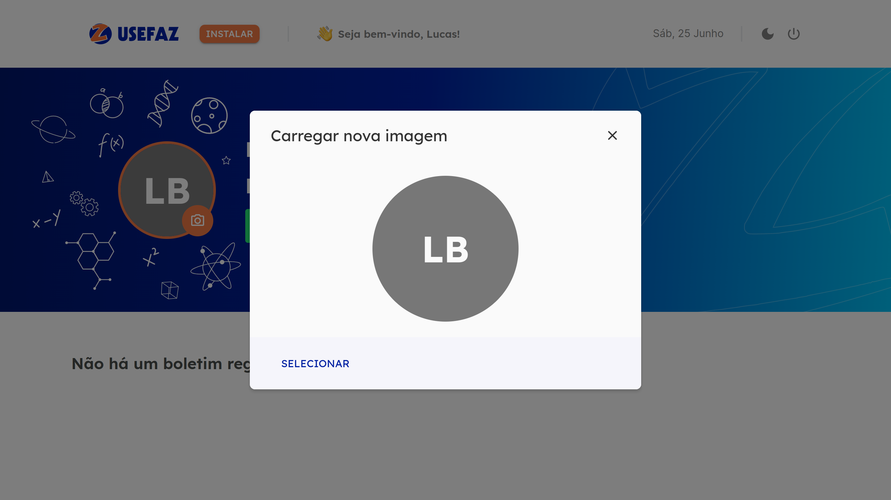
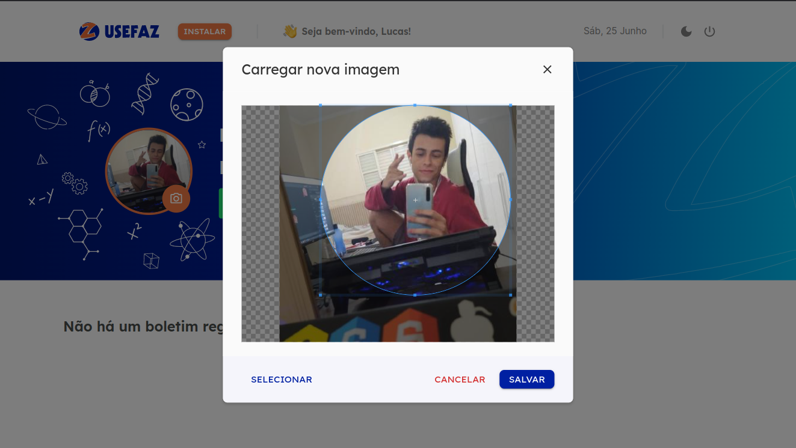
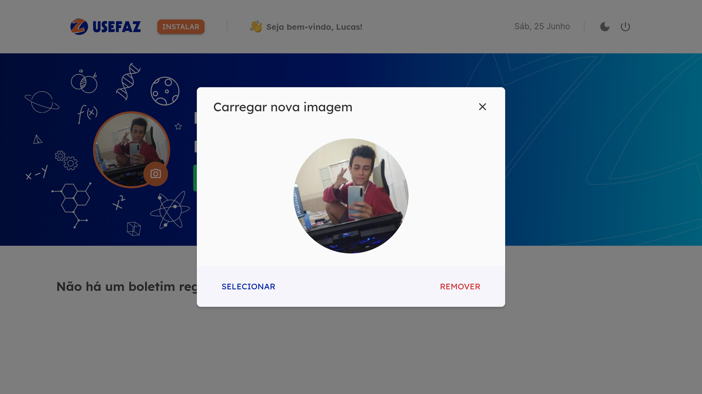
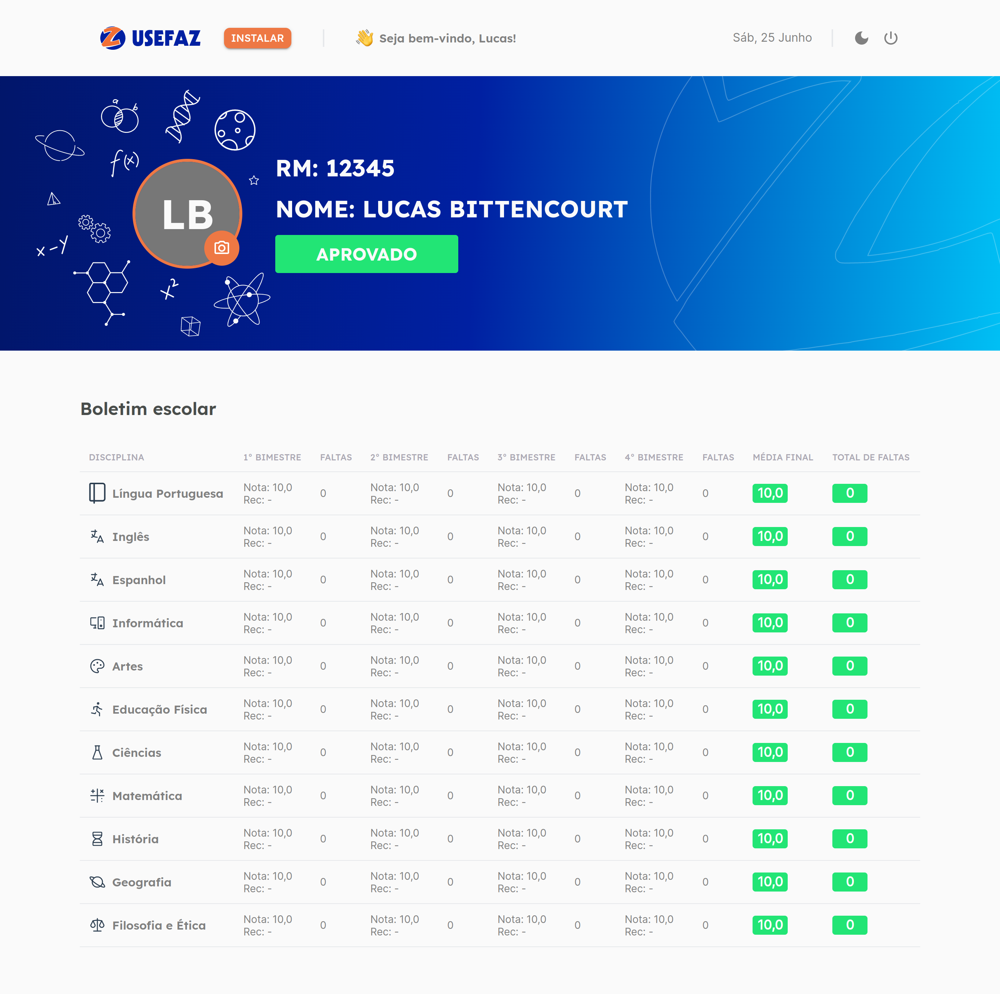
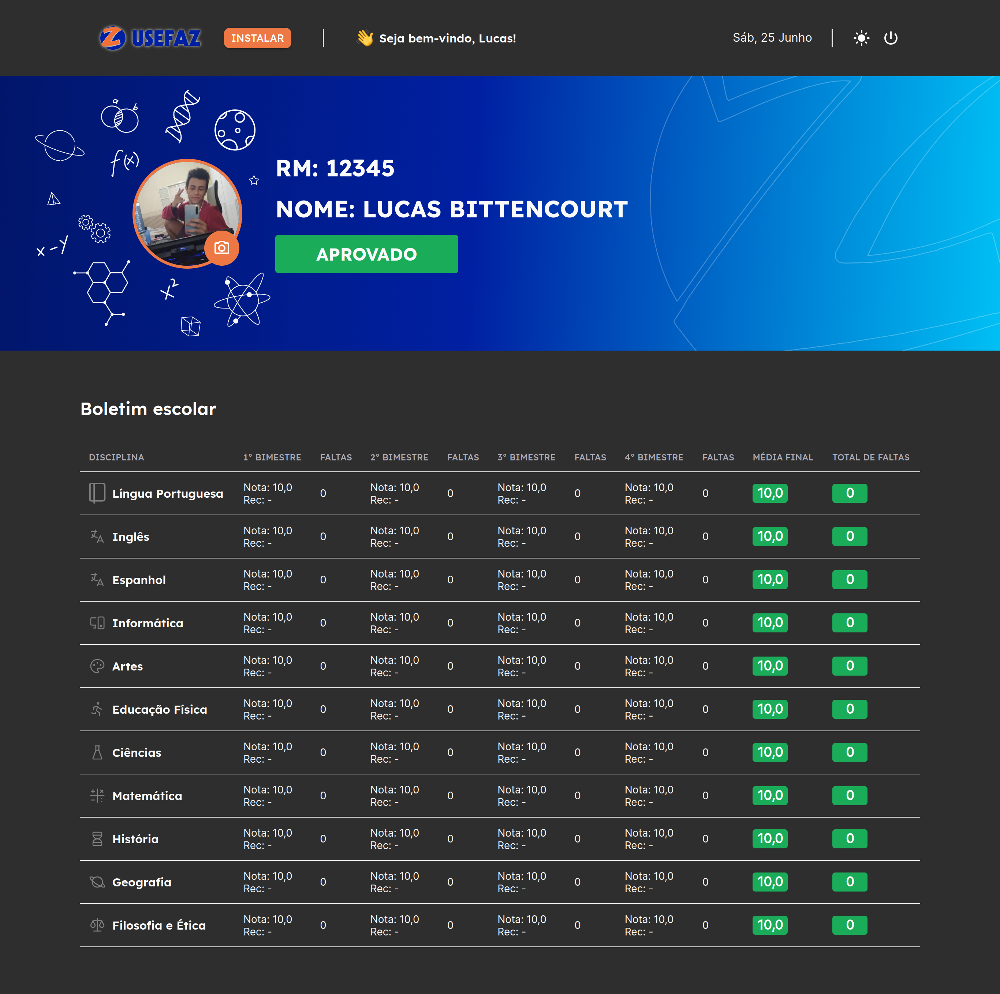

## Telas do Sistema do Administrador

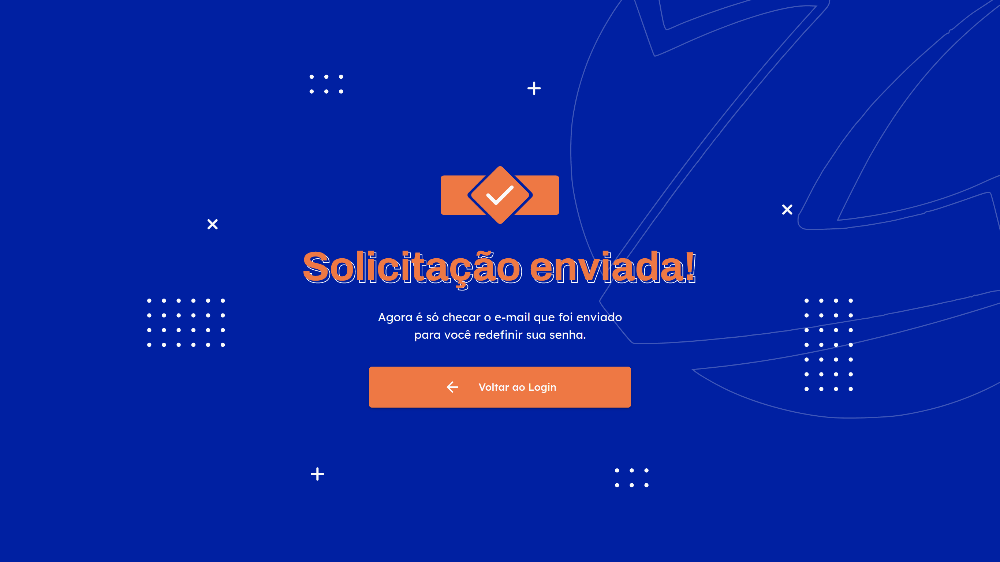

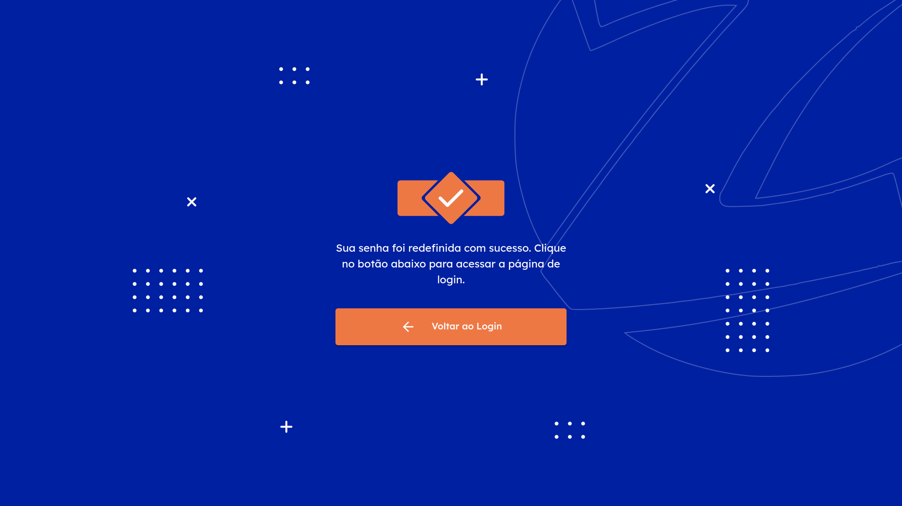
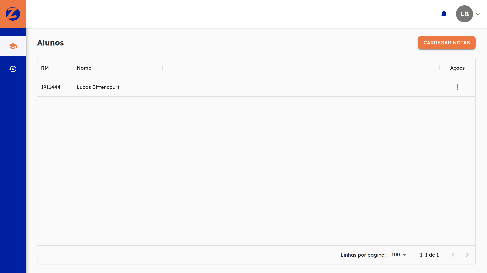
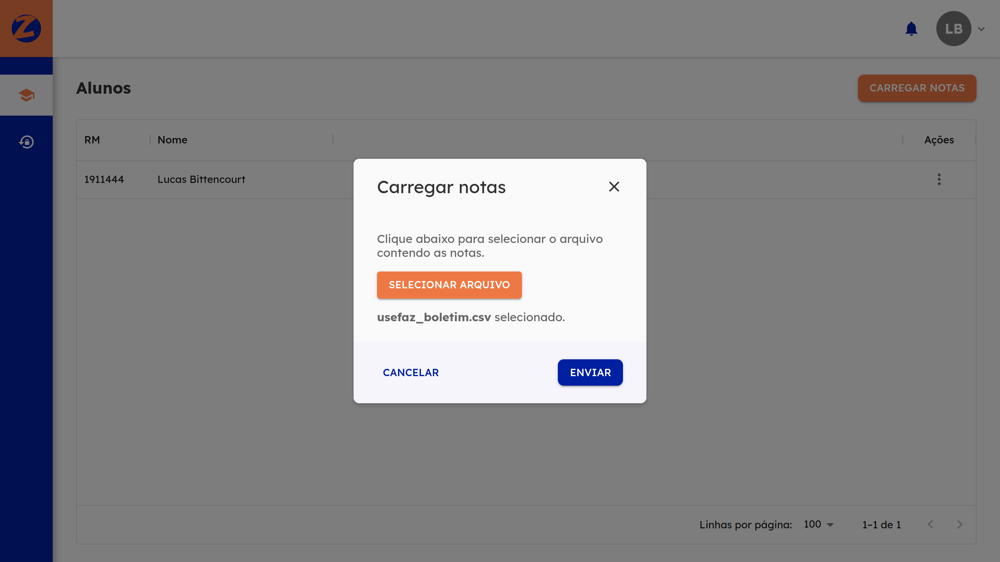
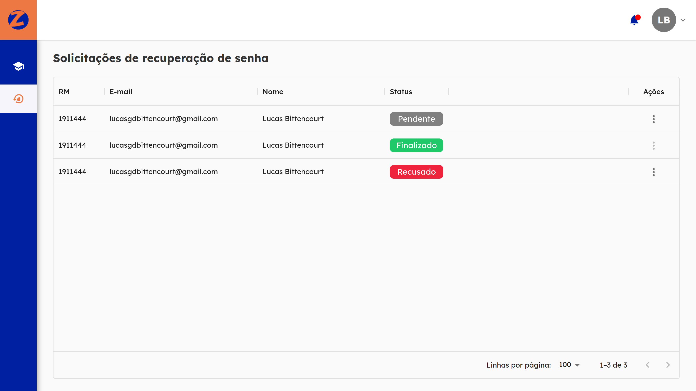
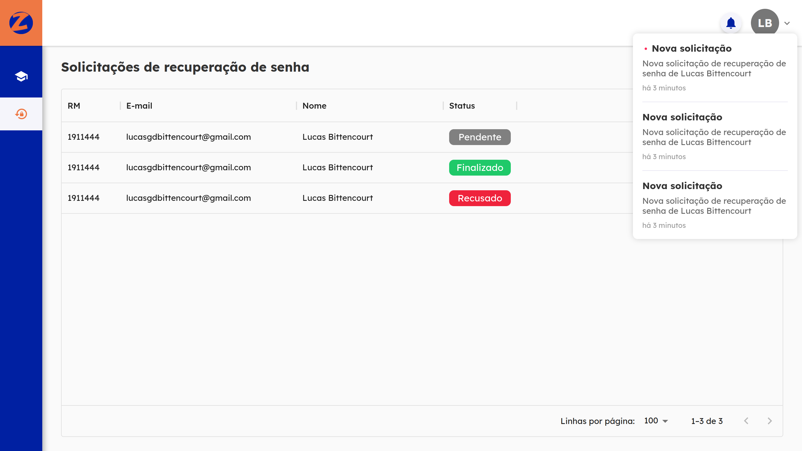
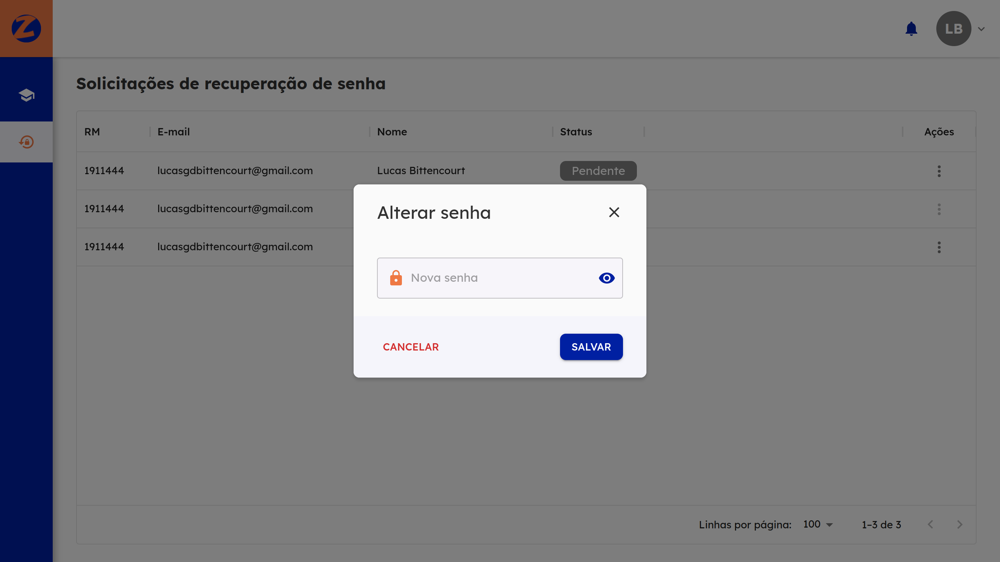

## Autor

| [ @lucasgdb](https://github.com/lucasgdb) |
| :----------------------------------------------------------------------------------------------------------------------------: |
